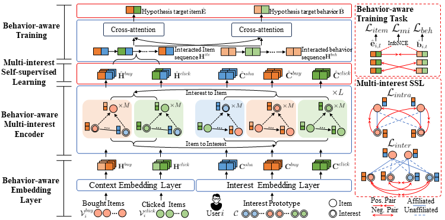

# When Multi-Behavior Meets Multi-Interest: Multi-Behavior Sequential Recommendation with Multi-Interest Self-Supervised Learning

This is the official code for our proposed model **MISSL** (ICDE-24). The code is built upon [MB-STR](https://github.com/yuanenming/mb-str).

## Abstract
Sequential recommendation utilizes interaction history to uncover users' dynamic interest changes and recommend the most relevant items for their next interaction.
In recent years, multi-behavior modeling and multi-interest modeling have been hot research topics. Although multi-behavior and multi-interest methods have strengths in their respective domains, both have limitations. Multi-behavior methods focus excessively on target behavior recommendation (i.e., purchase) without sufficiently leveraging auxiliary behavior interactions (i.e., click) to discern users' multi-faced interests, leading to suboptimal recommendation quality. Meanwhile, existing multi-interest methods overlook the distinct user interests behind multi-behavior when extracting interests, resulting in inaccurate interest modeling. Combining the two can not only facilitate sophisticated modeling of complex user interests but also deepen understanding of multi-behavior interactions, achieving synergistic effects. In this paper, we propose a novel approach called Multi-Interest Self-Supervised Learning (MISSL) that precisely unifies multi-behavior and multi-interest modeling to obtain more comprehensive and accurate user profiles. MISSL utilizes a hypergraph transformer network to extract behavior-specific and shared interests followed by multi-interest self-supervised learning to refine item and interest representations further. Additionally, a behavior-aware training task is incorporated to enhance model stability during training. Extensive experiments on benchmark datasets demonstrate that MISSL outperforms baseline methods. The source code for MISSL is available at: https://github.com/KNwbq/MISSL.

<center>
  
</center>

## Requirements

Run the following code to satisfy the requirements by pip:

```
pip install -r requirements.txt
```

## Datasets

- The `Yelp` dataset is already located in the `\data` folder. To obtain the other two public datasets, you can download them at:

  Google Drive: https://drive.google.com/file/d/1qOf2-Mwag0qzT6bPLFrQ7cNd_S1QDBbw/view?usp=drive_link

  Baidu Drive: https://pan.baidu.com/s/1W5ASbe2rqpEEvpZccAZ3Ow?pwd=ey5h

- unzip the `datasets.zip`

- Place the datasets into the `\data` folder.

## Run MISSL

Run on  `Yelp`  with a `yaml` configuration file like following:

```bash
python run.py fit --config src/configs/yelp/yelp_missl.yaml
```

